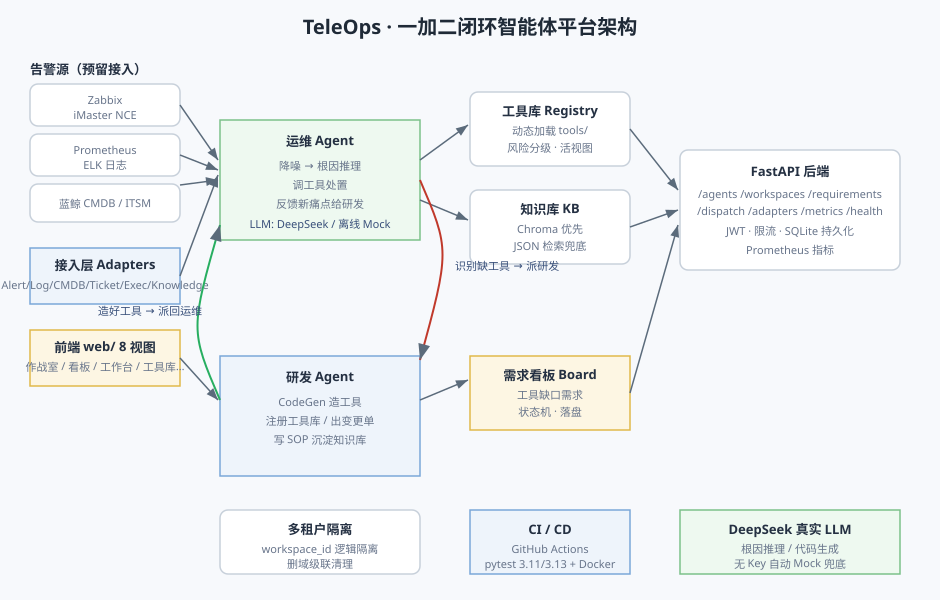
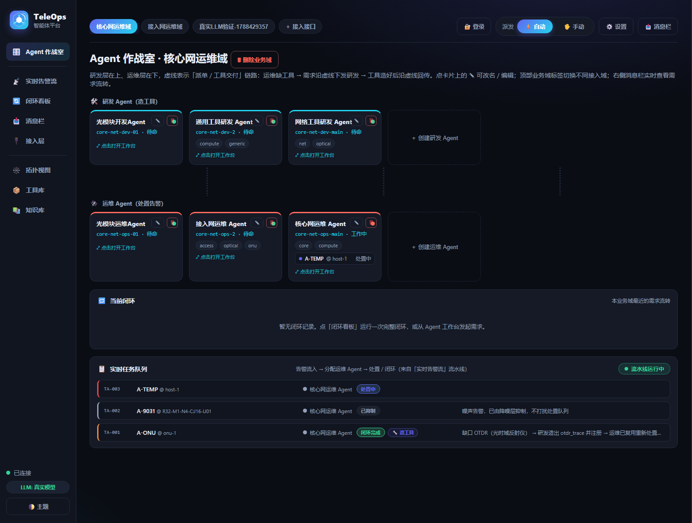
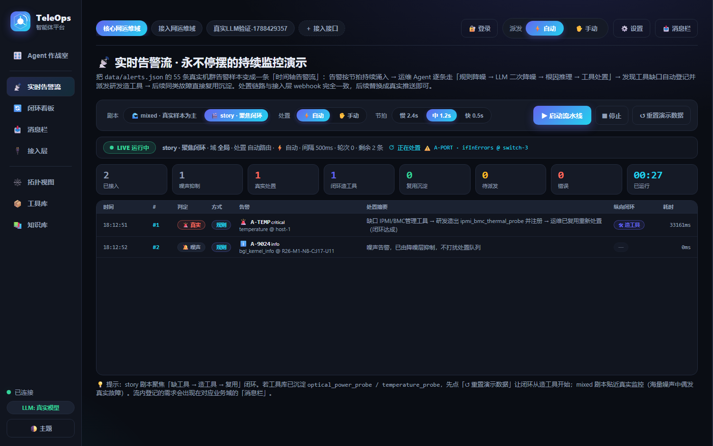
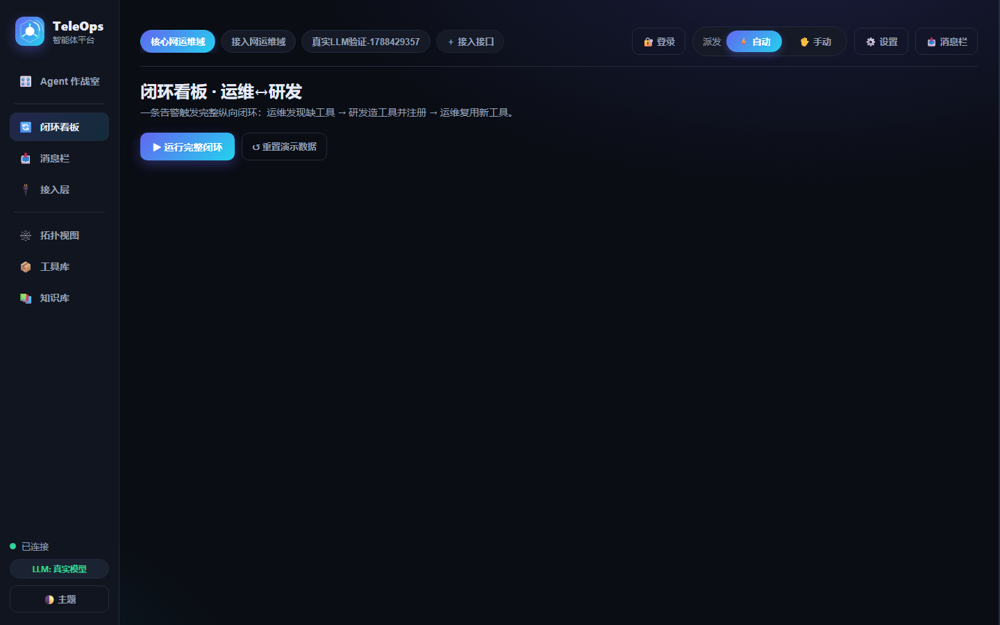
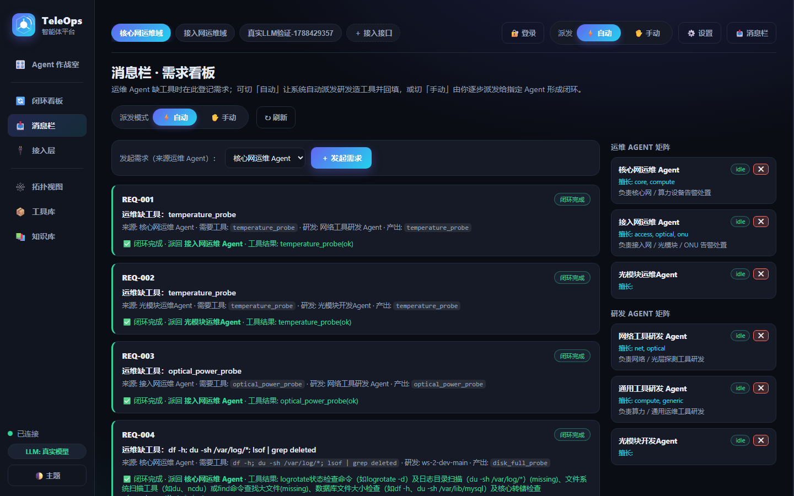
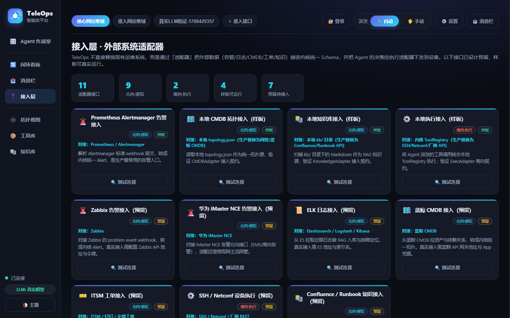
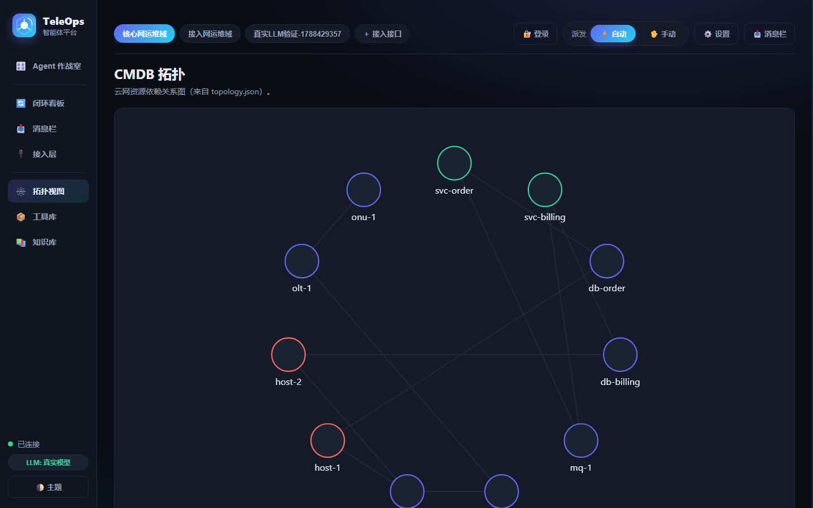
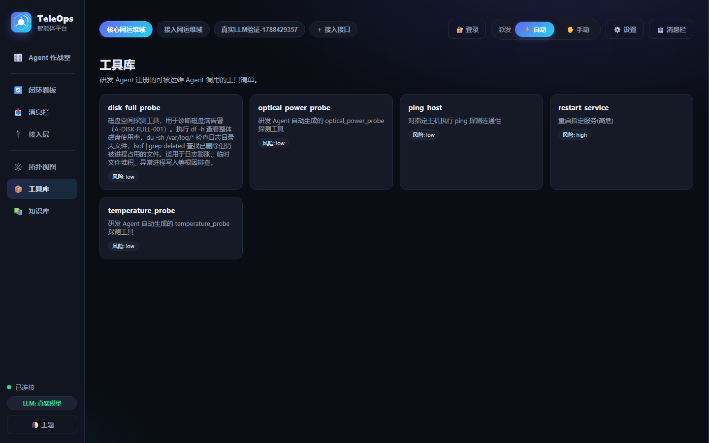
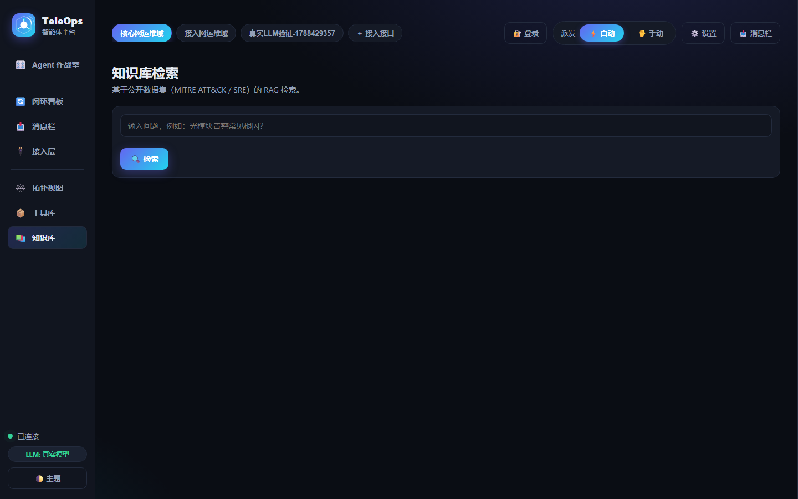
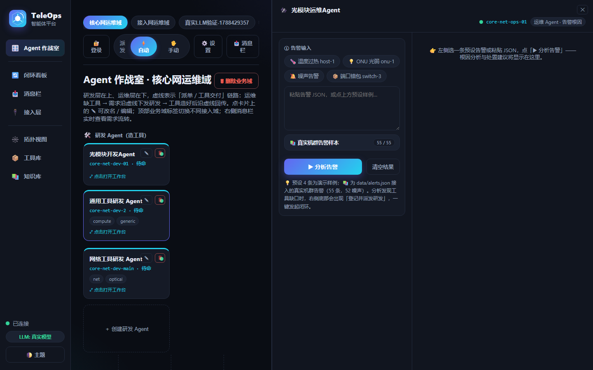

# TeleOps 智能体平台（W1 → W4）

[](https://github.com/chenli2919539686/TeleOps/actions)
[](https://www.python.org/)
[](https://github.com/chenli2919539686/TeleOps/actions)
[](LICENSE)

> **仓库**：https://github.com/chenli2919539686/TeleOps
> CI 覆盖 pytest（3.11 / 3.13）、静态检查（Python 编译 + 前端 JS 语法 + compose 校验）、Docker 镜像构建。

> 运营商云网「研发数字员工 × 运维 Agent」纵向闭环 —— 策略 B 落地项目。
> 当前进度：**W1 地基 + W2 双 Agent 闭环 + W3 FastAPI 后端 + W4 前端** 已完成，并新增 **多 Agent 注册表 + 消息栏需求看板 + 自动/手动可切换派发**（含 OpenClaw 风格动态前端）。可无 API Key 端到端跑通、可离线演示、可部署上线。

## 项目定位
一个通用 Agent 平台底座，上面跑两个智能体：
- **研发数字员工**：造运维工具、出变更单、写知识（→ 沉淀进工具库 / 知识库）
- **运维 Agent**：收告警、降噪、根因推理、调工具处置（→ 反馈新痛点给研发）

两者经「故障反馈」闭环联动，对应运营商「业务运维一体化」。

## 架构概览



> **一加二闭环**：运维 Agent 识别「缺工具」→ 派发研发 Agent 造工具并写 SOP → 派回运维复用；工具库 / 知识库双向沉淀，告警源经接入层统一收口。前端 9 视图经 FastAPI 同源托管（新增 **实时告警流** 监控大屏，让 Agent 持续降噪/根因/处置并自动演示沉淀→复用；流水线告警进一步落地为作战室 **实时任务队列**，每条告警作为任务分配给运维 Agent），多租户按 `workspace_id` 逻辑隔离，CI/CD 与 DeepSeek 真实 LLM 已接入（无 Key 自动 Mock 兜底）。

## 界面演示

以下截图均由本地后端（`127.0.0.1:8000`）真实渲染，通过 `scripts/capture_shots.js`（playwright-core + 系统 Edge）自动捕获，可直接用于面试/答辩演示。

| Agent 作战室 + 实时任务队列 | 实时告警流 | 闭环看板 |
|---|---|---|
|  |  |  |
| **消息栏需求看板** | **接入层** | **拓扑视图** |
|  |  |  |
| **工具库** | **知识库** | **Agent 工作台（含告警样本库）** |
|  |  |  |

工作台中的 📚 **真实机群告警样本** 直接来自 `data/alerts.json`（55 条 BlueGene/L 真实事件，3 严重 / 52 噪声），点击任意条目即可填入左侧 JSON 框，一键触发根因分析；若发现工具缺口，底部会自动出现「登记并派发研发」按钮，进入一加二闭环。

实时告警流把静态样本变成一条「时间轴告警流」：后端 `src/core/alert_stream.py` 按节拍持续推送 55 条真实机群告警 + 故障剧本，运维 Agent 逐条走「规则降噪 → LLM 二次降噪 → 根因推理 → 工具处置 → 缺工具则自动登记并派发研发造工具 → 后续同类故障直接复用沉淀」；处置链路与接入层 webhook 完全一致，后续替换成真实告警推送即可。

## 目录结构
```
TeleOps/
├── README.md
├── LICENSE                   # MIT 许可证
├── requirements.txt          # 运行依赖（FastAPI / langgraph / openai / networkx …）
├── requirements-dev.txt      # 开发 / CI 依赖（含 pytest），与运行时分层隔离
├── pytest.ini                # pytest 配置
├── .env.example
├── .dockerignore             # 构建镜像时排除 .env / .git / 缓存 / 虚拟环境
├── docs/                     # 文档素材（架构图 architecture.svg + 界面截图 shots/，用于 README 演示）
├── data/                     # 数据层：topology/tools/feedback=自造；alerts=公开日志转换
│   └── raw/                  # 公开日志原始样本（hdfs_sample.log / bgl_sample.log）
├── kb/                       # 知识库 markdown（来自 MITRE ATT&CK / SRE 公开知识）
├── src/
│   ├── config.py             # 路径与模型配置（支持 TELEOPS_* 注入）
│   ├── llm_client.py         # LLMClient 抽象层（DeepSeek / Ollama / 离线 Mock 兜底）
│   ├── core/
│   │   ├── db.py             # SQLite 持久化（WAL + busy_timeout，自动迁移 JSON）
│   │   ├── auth.py           # JWT 实现（HS256，零新依赖）
│   │   ├── metrics.py        # 零依赖 Prometheus 指标（counter/histogram/gauge）
│   │   ├── rate_limit.py     # 进程内滑动窗口限流中间件
│   │   ├── cmdb_graph.py     # CMDB 拓扑图（networkx，含 fallback）
│   │   ├── tool_registry.py  # 工具库 registry（动态加载 + 风险分级）
│   │   ├── kb_store.py       # 知识库（Chroma 优先，纯 JSON 检索兜底）
│   │   ├── agent_registry.py # 多 Agent 注册表（2 运维 + 2 研发，按 scope 路由）
│   │   ├── requirement_board.py # 消息栏需求看板（工具缺口需求 + 状态机，落盘）
│   │   └── alert_stream.py   # 模拟告警流水线：持续告警流 + 处置闭环 + feed 缓冲
│   ├── agents/
│   │   ├── ops_agent.py      # 运维 Agent：降噪 + 根因推理 + 工具调用 + 处置建议
│   │   └── dev_agent.py      # 研发 Agent：CodeGen 造工具 + 注册 + 变更单 + SOP 沉淀
│   ├── orchestration/
│   │   ├── graphs.py         # LangGraph 编排：运维闭环图 + 研发闭环图
│   │   └── dispatch.py       # 派发器：消息栏 → 研发造工具 → 派回运维（自动/手动）
│   ├── adapters/             # 接入层：外部运维系统接进内核统一 Schema（北向感知 + 南向执行）
│   │   ├── base.py           # 6 类适配器抽象基类（Alert/Log/CMDB/Ticket/Exec/Knowledge）
│   │   ├── sample_adapters.py   # 可跑样板：Prometheus 告警 / 本地 CMDB / 知识库 / 执行
│   │   ├── reserved_adapters.py # 预留占位：Zabbix/iMaster/ELK/蓝鲸/ITSM/SSH/Confluence
│   │   └── registry.py       # 适配器注册表（统一注册/查询/调用）
│   └── api/
│       └── server.py         # FastAPI 后端（/agents /dispatch /requirements /adapters /metrics /health* 等）
├── web/                      # 主界面：原生 HTML/CSS/JS 动态前端（9 视图，FastAPI 同源托管 /，含实时告警流）
├── tools/                    # 研发数字员工产出的小工具（示例 + 自动生成）
├── scripts/
│   ├── gen_data.py           # 一键造【自造】数据：拓扑/工具/反馈
│   ├── ingest_public.py      # 接入【真实公开】数据：日志->alerts、生成公开知识库
│   ├── reset_demo.py         # 重置演示数据（清自动生成工具 + 清空消息栏）
│   ├── build_hf_space.py     # 打包 HF Space 运行快照（剔除演示重依赖）
│   ├── demo_stream.py          # 模拟告警流水线 CLI（无 UI 场景 / 录屏 / CI）
│   ├── test_jwt_e2e.py       # JWT 端到端验证（12 项断言）
│   ├── verify_project.py     # 项目级验证（14 项）
│   ├── capture_shots.js      # 自动截图：后端启动后用 Edge 捕获前端 7 视图 + 工作台
│   └── _shoot_stream.js      # 自动截图：实时告警流面板
├── tests/                    # pytest 套件（61 项；临时库 + 离线 Mock，不污染运行数据）
│   ├── conftest.py           # 临时 DB + mock LLM + TestClient fixture
│   ├── test_auth.py / test_workspaces.py / test_closed_loop.py
│   ├── test_w3_endpoints.py  # 原 test_api.py 的 pytest 化版本
│   ├── test_agent_delete.py  # Agent 删除（含「保留最后 1 个同类型」保护）
│   ├── test_tool_reuse.py    # 工具复用回归（活视图 + 登记前查库兜底）
│   ├── test_llm_mock_determinism.py # Mock 诊断确定性（知识库上下文不干扰场景判断）
│   └── test_metrics.py / test_ratelimit.py / test_sanity.py
├── deploy/                   # 生产化部署（Phase 0 / 3）
│   ├── Dockerfile / docker-compose.yml / Caddyfile
│   ├── prometheus.yml        # 抓取 backend:8000/metrics
│   ├── grafana/              # 数据源 + 「TeleOps 运行概览」面板（observability profile）
│   └── README.md
├── .github/workflows/ci.yml  # GitHub Actions（3.11/3.13 矩阵 pytest + JS 校验 + Docker 构建）
├── app.py                    # 历史 Gradio 三 Tab 前台（备选演示 / HF Spaces 用，主界面见 web/）
├── demo.py / demo_w2.py      # W1 / W2 演示
├── CAREER.md / DEMO_SCRIPT.md       # 求职材料
└── TeleOps_使用手册.md / TeleOps_项目梳理.md / 接入层设计.md  # 项目文档
```

## 快速开始
```bash
# 0. 克隆仓库
git clone https://github.com/chenli2919539686/TeleOps.git
cd TeleOps

# 1. 建虚拟环境（本机已自带 Python 3.13，免安装）
python -m venv .venv
source .venv/Scripts/activate        # Git Bash
# .venv\Scripts\activate.bat         # PowerShell

# 2. 装依赖
pip install -r requirements.txt

# 3. 造【自造】数据：拓扑 / 工具注册表 / 反馈工单（必跑）
python scripts/gen_data.py

# 4. 接入【真实公开】数据：
#    4a. 告警库：把 LogHub 真实日志转成 alerts.json（项目自带样本可直接跑）
python scripts/ingest_public.py --convert --dataset bgl --raw data/raw/bgl_sample.log
#    4b. 知识库：生成 MITRE ATT&CK / SRE 公开知识
python scripts/ingest_public.py --make-kb
#    （若要完整真实数据集，联网机器上跑：python scripts/ingest_public.py --download）

# 5. 跑最小演示（无需 Key，演示数据层 + 能力层）
python demo.py

# 6. 跑 W2 闭环演示（无需 Key，离线 Mock 端到端跑通纵向闭环）
python demo_w2.py

# 7.（可选）接真实大模型：复制 .env.example 为 .env，填入 DEEPSEEK_API_KEY
cp .env.example .env
#    填好 Key 后重跑 demo_w2.py 即走 DeepSeek 真实推理（无 Key 自动 Mock 兜底）

# 8. 跑测试套件（pytest，无需启动服务器；自动使用临时数据库 + 离线 Mock，不污染运行数据）
python -m pytest          # 61 项：只读端点 / JWT 鉴权 / 业务域隔离 / 闭环编排 / 工具复用 / Mock 确定性 / 告警降噪分层 / W3 经典端点 / Prometheus 指标 / 限流

# 9. W3/主界面：启动真实 HTTP 服务 —— FastAPI 同源托管 web/ 前端（9 视图）
python -m uvicorn src.api.server:app --reload --port 8000
#    ✨ 浏览器打开 http://localhost:8000 即为主界面（作战室 / 实时告警流 / 闭环看板 / 工作台 / 工具库 / 消息栏…）
#    Swagger: http://localhost:8000/docs · 健康检查: curl http://127.0.0.1:8000/health
#    进入「实时告警流」面板可一键启动 story/mixed 流水线，Agent 持续降噪根因处置
#    curl -X POST http://127.0.0.1:8000/closed-loop/run -H "Content-Type: application/json" -d "{}"

# 10.（备选 / HF Spaces）历史 Gradio 三 Tab 前台（独立进程，无 9 视图闭环体验）
python app.py
#     浏览器打开 http://localhost:7860；部署见下方"部署到 HF Spaces"
#     （app.py 内置 ensure_data()，干净环境会自动造数据，无需先跑第 9 步）

# 注：本项目已把 langgraph / openai / fastapi / gradio 装进 WorkBuddy 隔离 Python，
#     故直接用 `python` 即可，无需额外建 venv。
```

## 当前进度（W1 → W4 全栈完成）
- [x] 环境 / 配置 / LLMClient 抽象（DeepSeek + 离线 Mock 双通道）
- [x] 【自造】数据：CMDB 拓扑、工具注册表、反馈工单（gen_data.py）
- [x] 【真实公开】数据：告警库 alerts.json（LogHub 日志转换）、知识库 kb/*.md（MITRE ATT&CK / SRE）
- [x] 能力层：CMDB 图、工具库 registry、知识库（含兜底检索）
- [x] **W2 双 Agent 核心**：运维 Agent（降噪/根因/调工具/处置）+ 研发 Agent（CodeGen 造工具/注册/变更单/SOP）
- [x] **W2 闭环编排**：LangGraph 编排运维闭环图 + 研发闭环图，端到端演示「告警→缺工具→研发造工具→运维复用」
- [x] **W3 后端 API**：FastAPI 把底层能力 + 双 Agent 暴露为 HTTP 接口，含 `/alert /chat /feedback /closed-loop/run` 等，闭环自动化；pytest 套件（`tests/`）验证全绿
- [x] **W4 前端 + 部署 + 求职材料**：**主界面 = FastAPI 同源托管 `web/` 前端**（原生 HTML/CSS/JS，左导航：Agent 作战室 / **实时告警流** / 闭环看板 / 消息栏 / 接入层 / 拓扑视图 / 工具库 / 知识库），含 Agent 增删、告警根因分析、真实告警样本库（55 条）、工具复用闭环；历史 Gradio 前台（app.py）留作 HF Spaces 备选；CAREER.md（STAR 话术 / 1 页简介）、DEMO_SCRIPT.md（录屏分镜）
- [x] **v0.8.0 · 持续监控演示**：新增后端 `src/core/alert_stream.py` 模拟告警流水线 + `/stream/*` API（start/stop/reset/status/feed）+ 前端「实时告警流」面板；流水线按节拍持续推送告警，Agent 逐条降噪/根因/处置，缺工具自动登记派发研发，后续同类故障直接复用沉淀，像真实监控大屏一样滚动展示。CLI 演示 `scripts/demo_stream.py` 同步可用。
- [x] **v0.8.1 · 告警→任务队列**：把「实时告警流」从独立大屏接入作战室。新增 `src/core/alert_stream.py` 任务生命周期（queued → processing → done/suppressed/escalated/closed）+ `/stream/tasks` 端点；作战室 Agent 卡片实时显示「当前任务：A-XXX @ host-1 处置中」，作战室新增「实时任务队列」列表，展示每条告警的分配 Agent、状态徽章、闭环结果（造工具 / 复用 / 抑制）。修复 `RequirementBoard` 主键冲突，让 `reset-demo` 可反复重演。

> 国产化叙事点：LLMClient 抽象层可无缝切换 DeepSeek / Qwen / GLM；工具与知识库均可私有化部署。

## 生产化改造（Phase 0 / Phase 1）

**Phase 0 · 容器化部署**（`deploy/`）
- `docker-compose.yml`：backend + Caddy 自动 HTTPS 反代，单端口 80/443 对外，backend 不暴露宿主端口
- `Dockerfile`：精简依赖（剔除 gradio/chromadb 等演示组件），数据落 named volume
- `.env.example`：`TELEOPS_API_TOKEN` / `TELEOPS_CORS_ORIGINS` / `JWT_SECRET` 等密钥样例
- 详见 `deploy/README.md`

**Phase 1 · 持久化 + 每用户登录**
- SQLite 持久化：业务域 / Agent / 需求 / 工具 / 消息 / 用户全部落库（`data/teleops.db`），首次启动自动从遗留 JSON 迁移，重启不丢
- JWT 登录：`/auth/register` `/auth/login` `/auth/me`（HS256，stdlib 实现，零新依赖）；首个注册用户自动成为 admin
- 鉴权双轨：每用户 JWT 优先，未配置用户时可回退共享 `TELEOPS_API_TOKEN`；所有写接口（POST/PUT/DELETE）强制校验，读接口开放
- 前端：右上角登录/注册模态，登录后显示用户徽标；写操作 401 自动弹出登录框；JWT 存 localStorage 跨会话保活
- 验证：`python scripts/test_jwt_e2e.py`（12 项断言）与 `python scripts/verify_project.py`（14 项，含 JWT 登录与数据清理）全绿

**Phase 2 · 测试 + CI + 可观测性**
- pytest 套件（`tests/`，61 项）：自动使用临时数据库 + 离线 Mock，**不污染运行数据**；覆盖鉴权/业务域 CRUD 与跨域隔离/告警闭环/需求派发/工具复用（活视图 + 登记兜底）/Mock 跨平台确定性/Agent 增删（含删域级联清理）/知识库 RAG/W3 经典端点/Prometheus 指标/限流/告警降噪分层（Phase 2 起 38 项，Phase 3 增 3 项限流测试，v0.7.x 增 Agent 删除 2 项、工具复用 3 项、Mock 确定性 3 项与级联清理 1 项，v0.7.6 增降噪分层 11 项）
- 测试隔离改造：`TELEOPS_DB_FILE` / `TELEOPS_TOOLS_DIR` / `TELEOPS_KB_DIR` 环境变量可注入；测试修掉了 `db.execute` 返回 None、`/alert` 缺字段崩溃两个真实 bug
- CI：`.github/workflows/ci.yml`（GitHub Actions：3.11/3.13 矩阵跑 pytest + JS 语法检查 + 前端静态一致性校验 + Docker 镜像构建）；**已在 GitHub 实跑全绿**
- Prometheus 指标：零第三方依赖实现 `GET /metrics`（Prometheus 文本格式），HTTP 请求计数/耗时直方图（按路由模板聚合）、Agent 任务数、LLM 调用数、业务域/Agent/需求实时 gauge；middleware 自动埋点
- 依赖分层：`requirements-dev.txt`（开发/CI 用，含 pytest）；`deploy/requirements.txt` 保持精简（运行时不装 pytest）

**Phase 3 · 高可用 + 限流 + 可观测性部署**（v0.7.0）
- **限流**：进程内滑动窗口中间件（零依赖，默认开启）。按客户端 IP 分三档：读 300 次/分、写 60 次/分、登录注册 10 次/分（防口令爆破）；超限返回 429 + `Retry-After`，并被计入 `teleops_rate_limited_total` 指标。`/metrics`、`/health*`、静态资源不占额度。开关与阈值经环境变量 `TELEOPS_RATE_LIMIT=on|off` 与 `TELEOPS_RATE_LIMIT_READ/WRITE/LOGIN` 调节（运行时也可程序化调整，见 `src/core/rate_limit.py`）。
- **SQLite 高可用**：连接开启 `WAL`（读写不互斥）+ `synchronous=NORMAL` + `busy_timeout=5s`（锁冲突等待而非报错），适配「HTTP 读 + 后台 Agent 写」并发形态；进程崩溃不损坏库文件。
- **健康检查分离**：`/health`（liveness：进程 + DB 存活、运行中任务数、uptime、限流状态）+ `/health/ready`（readiness：DB 可查询 + 数据目录可写才上报 ready），供编排器探活与决定是否引流。
- **可观测性部署**：`docker compose --profile observability up -d` 一条命令拉起 Prometheus + Grafana，预置数据源与「TeleOps 运行概览」面板（QPS / 状态码 / 延迟分位 / 429 限流 / 任务·LLM 速率 / 业务实时 gauge / 运行时长），见 `deploy/README.md` 第 8 节。
- 测试：新增 `tests/test_ratelimit.py` 3 项（登录档 429+Retry-After 且不牵连读档、写档超限 429 已放行请求正常、`/metrics`·`/health`·静态资源放行 + 指标入账）；**该轮全量 pytest 41 项全绿**（v0.7.1+ 增 Agent 删除 2 项、v0.7.2 增工具复用 3 项、v0.7.6 增 Mock 确定性 3 项与级联清理 1 项 → 现 50 项，同年 9 月再增告警降噪分层 11 项 → **现 61 项**，见 Phase 2 说明）。

**v0.8.2 · 闭环链路提速（真实 LLM 下首遇告警 34s → 约 10s）**
- **造工具与写 SOP 并行**：`DevAgent.fulfill_feedback` 用线程池并发跑 CODEGEN 与 SOP 生成（SOP 工具名取派发需求中的 `needed_tool`），两次 LLM 调用从串行 28s 缩到取最大值约 14s；提示词同时要求精简输出（工具代码 30 行内、SOP 600 字内）进一步压缩生成时间。
- **round2 复用首轮诊断**：`raise_requirement` 把完整根因诊断随需求落库；`dispatch_to_ops` 回派时新增 `OpsAgent.redrive`——跳过重复的降噪 + 根因推理（约 7s），只重跑工具执行验证复用生效；旧需求无诊断时自动回退完整 `handle_alert`。
- **LLM 降噪结果缓存**：相同内容的告警（剧本循环重放）命中缓存直接返回，第二轮起不再重复调用降噪 LLM。
- 实测（DeepSeek 真实调用）：story 剧本首遇告警 34s → 8~16s，复用告警 3~5s，噪声规则层 0ms；75 秒内跑完 2 轮 16 条（6 造工具 + 2 复用 + 8 抑制），errors=0；pytest 61 项全绿。

**v0.8.1 · 告警流进作战室：实时任务队列**
- **任务队列模型**：在 `src/core/alert_stream.py` 中新增 task 生命周期（`queued → processing → done/suppressed/escalated/closed`），每条非噪声告警作为一个任务自动分配给流水线归属的运维 Agent；任务状态随处置过程实时收敛，并暴露 `GET /stream/tasks?limit=N&agent_id=` 供作战室轮询。
- **作战室实时联动**：Agent 卡片下方新增「当前任务」行，显示该 Agent 正在处理的告警（如 `A-TEMP @ host-1 处置中`）；作战室新增「实时任务队列」区块，展示任务 ID、告警、主机、分配 Agent、状态徽章、闭环徽章（造工具 / 复用 / 已抑制）。状态与后端 `registry.status` 同步刷新，流水线停止后状态立即显示「未运行」。
- **闭环修复与健壮性**：修复 `RequirementBoard` 因内存 seq 漂移导致的历史 `requirements.id` 主键冲突；`POST /stream/reset-demo` 现在会一并清空 `requirements` 表，让「缺工具 → 造工具 → 复用」闭环可反复重演；`pytest 61 项全绿`。
- **版本统一升级到 0.8.1**：`package.json`、`src/api/server.py`、`web/index.html` 缓存戳同步。

**v0.8.0 · 持续告警流演示**
- 新增 `src/core/alert_stream.py` 模拟告警流水线：把 `data/alerts.json` 的 55 条真实机群样本 + 3 条接入域故障剧本编排成「时间轴告警流」，后台线程按节拍持续推送；处置链路复用既有 `_ingest_flow`（与 webhook 接入完全一致），实现「缺工具 → 研发造工具 → 运维复用」闭环，并演示第二轮同类故障直接复用沉淀。
- 新增 `/stream/start|stop|reset-demo|status|feed` 端点：`/stream/status` 与 `/stream/feed` 被限流白名单放行，前端可秒级轮询；启动时自动清洗样本预标字段，让流水线上每次降噪都真实跑规则 + LLM。
- 前端新增「实时告警流」视图：分段控件切换剧本（mixed/story）、派发模式（auto/manual）、节拍（慢/中/快）；实时状态栏显示 LIVE 状态 / 当前告警 / 轮次；统计卡展示已接入 / 噪声抑制 / 真实处置 / 造工具 / 复用沉淀 / 错误；feed 表以监控大屏风格滚动，直观呈现 Agent 降噪、根因、闭环处置全过程。
- 新增 `scripts/demo_stream.py` CLI：无 UI 场景下也能启动同一引擎，适合 CI / 录屏 / 后台演示。参数化 `--profile story --limit N --interval 500`。
- 验证：真实 DeepSeek LLM 下 story 剧本 10 条实测——5 条噪声规则抑制、5 条真实故障产生 4 个新工具 + 1 个复用，errors=0；pytest 61 项全绿；HF Spaces 快照同步后版本戳一致。

**多租户决策（Phase 3 边界说明）**
当前采用**两级轻量租户隔离**且已实测：
- **业务域 = 租户粒度**：requirements / agents / messages 均带 `workspace_id`，派发路由按域隔离（跨域实测不串）、删域级联清理；
- **用户 = JWT 身份**：首注册用户自动 admin，写接口强制鉴权（每用户 JWT 优先，共享 Token 回退）。

本轮**不做组织级硬隔离**（新增 tenant 表、全链路 tenant 上下文、按租户分密钥）：单服务部署下收益与成本不成比例，且需大改数据模型/API/前端/测试。演进路径（出现多副本或多客户独立运营需求时）：加 `tenant_id` 外键 → 中间件注入 tenant 上下文 + 全部查询强制过滤 → 回归测试 → 前端登录选租户；多副本共享限流计数时把进程内窗口换 Redis。

## 部署到 Hugging Face Spaces

本项目 `app.py` 是 standalone 设计（不依赖外部 FastAPI 进程），可直接作为 HF Space 运行：

1. 在 Hugging Face 新建一个 **Space**（选 Gradio SDK）。
2. 把整个 `TeleOps/` 目录（含 `app.py` / `src/` / `data/` / `kb/` / `requirements.txt`）推到 Space 的 git 仓库。
3. HF 会自动读 `requirements.txt` 安装依赖，并用 `python app.py` 启动；`app.py` 已读取 `PORT` 环境变量并内置 `ensure_data()` 自动造数据。
4. 可选：在 Space 的 Secrets 里加 `DEEPSEEK_API_KEY`，即从离线 Mock 切换为真实大模型推理。

> 本地演示同样一条命令：`python app.py` → 打开 http://localhost:7860。
>
> 说明：本地开发/面试演示的**主界面是 `web/` 9 视图前端**（第 9 步 uvicorn 一条命令，打开 http://localhost:8000）；app.py（Gradio）仅在 HF Spaces 场景作为免后端进程的轻量入口。

## 求职材料

- `CAREER.md`：项目定位、技术栈、STAR 话术、三大亮点（对应三类 JD）、面试深挖 Q&A、1 页项目简介。
- `DEMO_SCRIPT.md`：2-3 分钟面试录屏分镜，照着点即可录制 demo。
